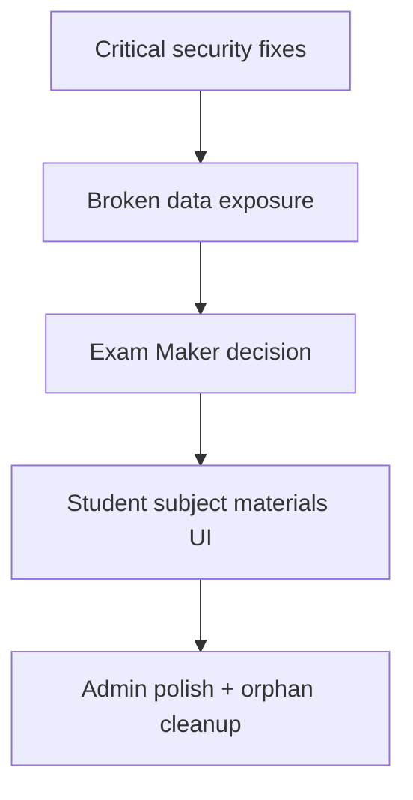

# LenLearn LMS — Full System Audit Report

## STEP 1: FUNCTIONAL AUDIT

### Admin Portal

| Module | Status | Notes |
|--------|--------|-------|
| **Login / Auth** | Working | `/login/institute`, Better Auth username/password + email OTP 2FA, role guard in [`Frontend/src/routes/AdminDashboardRoute.jsx`](Frontend/src/routes/AdminDashboardRoute.jsx), idle logout, terms gate |
| **Dashboard** | Partially working | Stats, announcements widget, audit charts work via [`Frontend/src/InstituteDashboard.jsx`](Frontend/src/InstituteDashboard.jsx). **Gap:** hardcoded display name `"Derek John Bantad"` (~line 3121) instead of session profile |
| **Academic Management** | Working | Subjects, sections, students, curriculum all PostgreSQL-backed. Curriculum unified to [`/api/admin/curriculum-guides`](server/api/adminCurriculumGuides.js) with file upload + reload on boot (recent fix). Legacy `/api/v1/curriculum` unused; orphan page [`AdminCurriculumGuidesPage.jsx`](Frontend/src/modules/admin/AdminCurriculumGuidesPage.jsx) not routed |
| **User Management** | Working | Faculty + student CRUD, Better Auth linking, archive vault, password reset via [`Faculties.jsx`](Frontend/src/pages/Faculties.jsx), [`Students.jsx`](Frontend/src/pages/Students.jsx) |
| **Monitoring & Security** | Working | Audit logs, statistics, bulk clear in [`MonitoringRecords.jsx`](Frontend/src/pages/MonitoringRecords.jsx). **Gap:** `GET /api/monitoring/compliance-report` has no UI; single-log delete is super-admin only with no UI |
| **Backup & Recovery** | Working | `.lnbak` backup/restore, scheduling, Google Drive in [`BackupPage.jsx`](Frontend/src/pages/BackupPage.jsx). Returns 503 without `DATABASE_URL` |
| **Updates (Announcements)** | Working | Full CRUD via [`UpdatesModule.jsx`](Frontend/src/modules/updates/UpdatesModule.jsx) + [`announcementsRouter.js`](server/api/state/announcementsRouter.js) |
| **Terms & Conditions** | Working | Gate at `/admin/terms`, DB persistence via [`termsV1.js`](server/api/termsV1.js) |

**Admin degraded mode:** If PostgreSQL is down, all `/api/v1/*` return 503 — UI may show empty lists while `persistenceMode === 'server'`.

---

### Faculty Portal

| Module | Status | Notes |
|--------|--------|-------|
| **Login / Auth** | Working | `/login/faculty`, 2FA, terms gate via [`TeacherProtectedRoute.jsx`](Frontend/src/routes/TeacherProtectedRoute.jsx) |
| **Dashboard** | Working | [`TeacherDashboard.jsx`](Frontend/src/pages/teachers/TeacherDashboard.jsx) + `/api/teacher/dashboard-stats` |
| **Curriculum** | Partially working | Read-only institute PDF guides via [`TeacherCurriculumPage.jsx`](Frontend/src/pages/teachers/TeacherCurriculumPage.jsx) → `/api/teacher/curriculum-guides`. Editable subject curriculum (modules/topics/lessons) lives under `/teacher/subjects/:id` — split UX |
| **Sections** | Working | Advisory sections + student roster via [`TeacherSectionsPage.jsx`](Frontend/src/pages/teachers/TeacherSectionsPage.jsx) |
| **Subject Materials** | Working | Two systems: per-subject (`/api/teacher/materials`) and faculty-wide study materials (`/api/v1/study-materials`) — both functional but confusing |
| **Quiz Maker** | Working | Full CRUD via [`TeacherQuizzesPage.jsx`](Frontend/src/pages/teachers/TeacherQuizzesPage.jsx) + [`quizzesV1.js`](server/api/quizzesV1.js) |
| **Exam Maker** | Not implemented | No `/teacher/exam*` routes. Legacy `Exam` type normalized to `Quiz` in [`quizQuestionTypes.js`](Frontend/src/lib/quizQuestionTypes.js). Redirect: `/teacher/quiz-maker` → `/teacher/quizzes` |
| **AI Plagiarism Checker** | Working | [`TeacherOriginalityCheckerPage.jsx`](Frontend/src/pages/teachers/TeacherOriginalityCheckerPage.jsx) + [`plagiarismReportsV1.js`](server/api/plagiarismReportsV1.js) |
| **Updates (Announcements)** | Working | [`TeacherAnnouncementsPage.jsx`](Frontend/src/pages/teachers/TeacherAnnouncementsPage.jsx) — no teacher DELETE endpoint |
| **Terms & Conditions** | Working | [`TeacherTermsPage.jsx`](Frontend/src/pages/teachers/TeacherTermsPage.jsx) |

**Dead code:** [`TeacherStubPage.jsx`](Frontend/src/pages/teachers/TeacherStubPage.jsx) ("coming soon") is unreferenced.

---

### Student Portal

| Module | Status | Notes |
|--------|--------|-------|
| **Login / Auth** | Working | `/login/student`, terms gate via [`StudentProtectedRoute.jsx`](Frontend/src/routes/StudentProtectedRoute.jsx) |
| **Dashboard** | Working | [`StudentDashboard.jsx`](Frontend/src/pages/students/StudentDashboard.jsx) |
| **Subjects** | Working | Grade-filtered list via [`StudentSubjectsPage.jsx`](Frontend/src/pages/students/StudentSubjectsPage.jsx). **Gap:** students in Grade 7–9 see zero subjects if DB only has Grade 10 subjects |
| **Assignments** | Working | List, view, submit via [`StudentAssignmentsPage.jsx`](Frontend/src/pages/students/StudentAssignmentsPage.jsx) + [`studentWorkV1.js`](server/api/studentWorkV1.js) |
| **Quiz** | Working | Take, save progress, submit, results via [`StudentQuizTakePage.jsx`](Frontend/src/pages/students/StudentQuizTakePage.jsx) + [`studentQuizV1.js`](server/api/studentQuizV1.js) |
| **Exam** | Not implemented | No separate exam routes; all assessments under `/student/quizzes` |
| **Updates (Announcements)** | Working | [`StudentAnnouncementsPage.jsx`](Frontend/src/pages/students/StudentAnnouncementsPage.jsx) |
| **Subject Materials** | Partially working | API `GET /api/v1/student/subjects/:id/materials` exists; client helper `fetchStudentSubjectMaterials()` in [`studentPortal.js`](Frontend/src/lib/studentPortal.js) is **never imported by any page**. Students see faculty-wide study materials + subject modules/stream only |
| **Terms & Conditions** | Working | [`StudentTermsPage.jsx`](Frontend/src/pages/students/StudentTermsPage.jsx) |

---

### Functional Fix Priority



1. **Critical:** Protect public `/uploads` and unauthenticated `GET /api/v1/state` (security — see Step 3)
2. **High:** Wire student per-subject materials API to subject profile UI
3. **Medium:** Decide Exam Maker scope — extend Quiz system with exam mode, or build separate module
4. **Low:** Remove hardcoded admin name; delete/route orphan pages; remove legacy `/api/v1/curriculum` calls

---

## STEP 2: DATABASE AUDIT

### Tables with full CRUD + archive

| Table | CREATE | READ | UPDATE | DELETE | Archive | Relationships |
|-------|--------|------|--------|--------|---------|---------------|
| `students` | POST `/v1/students` | GET | PUT | soft-archive | `archived_at` + vault | `section_id → sections` |
| `faculties` | POST `/v1/faculty` | GET | PUT | soft-archive | `archived_at` + vault | parent of `subjects`, `faculty_sections` |
| `sections` | POST `/v1/sections` | GET | PATCH only | DELETE | `status='archived'` | referenced by students, faculty_sections |

### Tables with full CRUD, no archive

| Table | Gap |
|-------|-----|
| `subjects` | Hard delete only — no `archived_at` |
| `announcements` | Hard delete only |
| `curriculum_guides` | Hard delete only (admin curriculum-guides API) |
| `curriculum` | Legacy table; admin UI no longer uses it |
| `quizzes` + children | `status` + `is_hidden` only, not true archive |
| `assignments`, `activities` | `status` draft/published only |
| `study_materials`, `subject_materials` | No archive |
| `plagiarism_reports` | No UPDATE REST endpoint |
| `subject_modules`, `subject_topics` | Hard delete via teacher API |

### Tables with intentional restrictions

| Table | Design |
|-------|--------|
| `audit_logs` | Append-only ledger; DELETE restricted to super-admin (single row) |
| `lms_activity_logs` | Write-only via logger; read via monitoring |
| `quiz_submissions`, `quiz_student_answers` | Created/updated via quiz flow; no direct REST CRUD |
| Better Auth tables | Managed by `/api/auth/*` |

### Migration status

- **48 migrations** in [`Database/migrations/`](Database/migrations/) (`003`–`050`), applied by [`scripts/run-migrations.mjs`](scripts/run-migrations.mjs)
- Runtime idempotent DDL also in [`server/api/state/shared.js`](server/api/state/shared.js) and `*Db.js` modules
- **Legacy [`Database/schema.sql`](Database/schema.sql)** is MySQL-style — **not** the PostgreSQL source of truth
- **FK gap:** `quiz_submissions.student_id` is BIGINT without FK to `students.id`

### Recommended archive migration (not yet implemented)

Add nullable `archived_at TIMESTAMPTZ` to operational tables that currently hard-delete:

```sql
-- Migration 051_add_archived_at_operational.sql (proposed)
ALTER TABLE subjects ADD COLUMN IF NOT EXISTS archived_at TIMESTAMPTZ;
ALTER TABLE announcements ADD COLUMN IF NOT EXISTS archived_at TIMESTAMPTZ;
ALTER TABLE curriculum_guides ADD COLUMN IF NOT EXISTS archived_at TIMESTAMPTZ;
ALTER TABLE quizzes ADD COLUMN IF NOT EXISTS archived_at TIMESTAMPTZ;
ALTER TABLE assignments ADD COLUMN IF NOT EXISTS archived_at TIMESTAMPTZ;
ALTER TABLE activities ADD COLUMN IF NOT EXISTS archived_at TIMESTAMPTZ;
ALTER TABLE study_materials ADD COLUMN IF NOT EXISTS archived_at TIMESTAMPTZ;
-- Filter: WHERE archived_at IS NULL on all list queries
-- Replace DELETE with UPDATE archived_at = NOW()
```

**Scope note:** Full archive rollout touches ~15 tables and all list/mutate queries — recommend phased implementation starting with `subjects` and `announcements`.

---

## STEP 3: SECURITY AUDIT

### What is working well

- Better Auth sessions: HttpOnly cookies, 7-day expiry, account lockout (5 attempts / 5 min) in [`server/auth.js`](server/auth.js)
- RBAC: `requireAdminSession`, `requireFacultyRole`, `requireStudentSession` on write paths
- Parameterized SQL throughout; dynamic DDL guarded by [`server/lib/sqlGuards.js`](server/lib/sqlGuards.js)
- Rate limiting on sign-in, OTP, password reset in [`server/index.js`](server/index.js)
- Input pattern blocking via [`server/middleware/sanitizeInput.js`](server/middleware/sanitizeInput.js)
- `student_id` always from session on student APIs ([`studentQuizV1.js`](server/api/studentQuizV1.js), [`studentWorkV1.js`](server/api/studentWorkV1.js))
- CSRF: SameSite=Lax + strict CORS allowlist (documented in [`docs/evidence/automated/Backend_Security_Evidence.txt`](docs/evidence/automated/Backend_Security_Evidence.txt))
- Helmet CSP, HSTS in production
- Production MFA enforcement at startup

---

### Vulnerabilities (ordered by severity)

#### CRITICAL

**1. Public static file serving — no auth**

- **File:** [`server/index.js`](server/index.js) line 490: `app.use('/uploads', express.static(uploadsDir))`
- **Risk:** Anyone with a URL can fetch student submissions, assignments, faculty photos, curriculum PDFs without login
- **Fix:** Remove public static mount; serve all files through authenticated [`server/api/fileDownload.js`](server/api/fileDownload.js) with role + ownership checks

**2. Unauthenticated institute state dump**

- **File:** [`server/api/state/stateRoutes.js`](server/api/state/stateRoutes.js) lines 15–32 — `GET /api/v1/state` has no `requireAdminSession`
- **Risk:** Full `app_state` JSON (legacy faculty emails, contacts, roster mirrors) exposed to unauthenticated callers
- **Fix:** Add `requireAdminSession` to GET handler (PUT already requires it)

---

#### HIGH

**3. Quiz violation logs are replaceable, not append-only**

- **Files:** [`server/lib/quizSubmissionsDb.js`](server/lib/quizSubmissionsDb.js) `saveQuizViolations()` (lines 835–842); [`server/api/studentQuizV1.js`](server/api/studentQuizV1.js) POST violations
- **Risk:** Student can POST `violations: []` to wipe history; full array replace; client-supplied timestamps
- **Fix:**
  - Append-only merge: `violations = violations || $1::jsonb` with dedup by type+timestamp
  - Reject payloads shorter than existing count
  - Server-side `timestamp: NOW()` instead of client body
  - Optional: separate `quiz_violation_events` append-only table

**4. Bulk audit log deletion by any admin**

- **File:** [`server/api/logs.js`](server/api/logs.js) line 481 — `DELETE /api/logs/audit/clear` uses `requireAdminSession` only; single-row delete requires `requireSuperAdminSession`
- **Risk:** Compromised admin can wipe forensic trail
- **Fix:** Change bulk clear to `requireSuperAdminSession`

**5. Unauthenticated read APIs expose institute metadata**

- **Files:** `GET /api/v1/subjects`, `/v1/sections`, `/v1/curriculum`, `/v1/announcements` — no session required on GET
- **Risk:** Enumeration + combined with public `/uploads` enables targeted file fetch
- **Fix:** Require appropriate role per endpoint, or strip sensitive fields for public reads

---

#### MEDIUM

| # | Issue | File | Fix |
|---|-------|------|-----|
| 6 | Weak `/api/files` ACL — any signed-in user for non-submission categories | [`fileDownload.js`](server/api/fileDownload.js) | Role + enrollment checks per category |
| 7 | Debug endpoint leaks Infra events to any authenticated user | [`server/index.js`](server/index.js) ~385 | Remove in prod or admin-only + env flag |
| 8 | Upload validation is extension/MIME only | `*Storage.js` modules | Add magic-byte verification (`file-type` npm) |
| 9 | Client-controlled quiz timing/answers | `quizSubmissionsDb.js` | Server-side timing correlation; validate answers against question bank |
| 10 | DOMPurify allows `style` attribute | [`Frontend/src/lib/sanitizeHtml.js`](Frontend/src/lib/sanitizeHtml.js) | Remove `style` from allowlist |
| 11 | Student session email fallback ambiguity | [`server/lib/studentSession.js`](server/lib/studentSession.js) | Match on `auth_user_id` only; fail if unlinked |

---

#### LOW / INFORMATIONAL

- Infra Sentinel disabled in dev unless `INFRA_SECURITY_ENABLED=true`
- Dev default `BETTER_AUTH_SECRET` fallback (blocked in prod)
- No explicit CSRF tokens (relying on SameSite + CORS — acceptable per OWASP when strict)
- `sanitizeInput` `--` pattern may block legitimate essay text

---

## STEP 4: GAP SUMMARY TABLE

| Module | Functional Gap | Database Gap | Security Gap | Priority |
|--------|---------------|--------------|--------------|----------|
| **File uploads (all portals)** | Works but files publicly accessible | N/A | Public `/uploads` static serving | **Critical** |
| **Admin state bootstrap** | Works when PG up | `app_state` legacy blob stale | `GET /v1/state` unauthenticated | **Critical** |
| **Quiz / Exam integrity** | Quiz works; Exam not built | Violations in mutable JSONB | Violation logs replaceable/erasable | **High** |
| **Audit / Monitoring** | Works | Immutable by design | Bulk clear = any admin | **High** |
| **Subjects (cross-portal)** | Teacher/student empty without faculty/grade match | No `archived_at` on subjects | Unauthenticated GET exposes catalog | **High** |
| **Exam Maker (Faculty)** | Not implemented | N/A | N/A | **Medium** |
| **Exam (Student)** | Not implemented | N/A | N/A | **Medium** |
| **Student subject materials** | API exists, UI not wired | `subject_materials` no archive | Weak file ACL if static removed | **Medium** |
| **Curriculum (Admin→Teacher)** | Fixed (curriculum_guides path) | Legacy `curriculum` table orphaned | Guides publicly fetchable via `/uploads` | **Medium** |
| **Announcements** | Works | Hard delete only | Unauthenticated GET | **Medium** |
| **Admin Dashboard** | Hardcoded admin name | N/A | N/A | **Low** |
| **Orphan code** | `AdminCurriculumGuidesPage`, `TeacherStubPage`, `/v1/curriculum` | N/A | N/A | **Low** |
| **Archive system** | Vault works for students/faculty | Most tables lack `archived_at` | N/A | **Low** |

---

## Consolidated Fix Plan (Priority Order)

### 1. Critical — Security vulnerabilities

1. Remove `express.static('/uploads')` from [`server/index.js`](server/index.js); route all downloads through authenticated `/api/files`
2. Add `requireAdminSession` to `GET /api/v1/state` in [`stateRoutes.js`](server/api/state/stateRoutes.js)
3. Make quiz violation logs append-only with server timestamps in [`quizSubmissionsDb.js`](server/lib/quizSubmissionsDb.js)
4. Restrict `DELETE /api/logs/audit/clear` to super-admin in [`logs.js`](server/api/logs.js)

### 2. Broken functionality fixes

5. Wire `fetchStudentSubjectMaterials()` into student subject profile page
6. Fix admin dashboard to display session user name instead of hardcoded string
7. Add bootstrap error banner when PostgreSQL APIs return 503 (surface offline state clearly)

### 3. Missing features to implement

8. **Exam Maker decision required:** Either add exam activity type with stricter proctoring, or document that Quiz system covers exams
9. Add teacher announcement DELETE endpoint (optional parity with admin)

### 4. Database / archive improvements

10. Migration `051_add_archived_at_operational.sql` for subjects, announcements, curriculum_guides, quizzes, assignments, activities
11. Add FK constraint: `quiz_submissions.student_id → students.id`
12. Deprecate legacy `curriculum` table and `/api/v1/curriculum` routes

### 5. Code quality improvements

13. Delete or route orphan pages (`AdminCurriculumGuidesPage`, `TeacherStubPage`)
14. Add magic-byte upload validation
15. Tighten `/api/files` category ACLs
16. Remove/guard debug endpoint in production
17. Extend [`scripts/live-api-flows.mjs`](scripts/live-api-flows.mjs) with authenticated CRUD round-trips

---

## STEP 5: NEXT ACTION

The audit is complete. **No code changes have been made in this pass.**

**Should I start fixing issues starting from Critical priority?**

Recommended first PR scope (Critical only):
- Protect `/uploads` behind auth
- Lock down `GET /api/v1/state`
- Append-only quiz violation logs
- Super-admin-only bulk audit clear

Confirm which priority tier to begin with (Critical only, Critical+High, or full plan).
