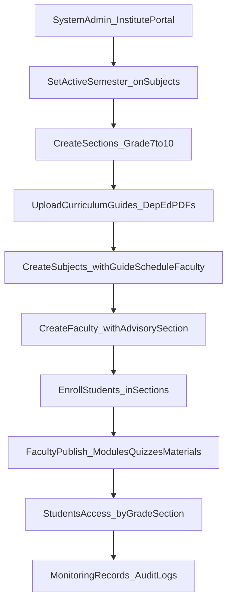
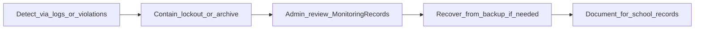

# Glendale School — LenLearn Process Flow and Incident Response

Documentation for the July 13, 2026 panel follow-up (Olympus group).

---

## 1. Glendale LMS process flow

LenLearn follows the institute workflow below. Each step maps to an admin or faculty portal screen and to PostgreSQL tables in production.

### Step-by-step (who does what)

| Step | Actor | LenLearn module | Data store |
|------|-------|-----------------|------------|
| 1 | System Admin | Institute → Dashboard | `"user"` role `admin` |
| 2 | System Admin | Sections → create grade/section | `sections` |
| 3 | System Admin | Curriculum → upload & publish PDF | `curriculum_guides` |
| 4 | System Admin | Subjects → code, grade, semester, **curriculum guide**, **schedule**, faculty | `subjects`, `subject_schedules`, `curriculum_guide_id` FK |
| 5 | System Admin | Faculties → profile + advisory section | `faculties`, `faculty_sections` |
| 6 | System Admin | Students → enroll in section | `students.section_id` |
| 7 | Faculty | Subject detail → modules, quizzes, materials | `subject_modules`, `quizzes`, `study_materials` |
| 8 | Student | Quizzes / materials (online or cached offline) | `quiz_submissions`, service worker cache |
| 9 | System Admin | Audit Logs | `audit_logs`, `lms_activity_logs` |

### Glendale business rules (capstone scope)

- **One advisory section per faculty** at creation (`faculty_sections` required).
- **One primary faculty owner per subject** (`subjects.faculty_id`).
- **Students see subjects by grade level + semester**, not per-subject enrollment (JHS 7–10 scope).
- **Faculty see advisory roster only** — name, enrollment, section, grades; **no student contact/address** (RA 10173 minimum necessary).
- **Curriculum guides** are official PDF references; subject syllabus PDF should align with the linked guide.

---

## 2. Role and access model

| Portal | Role in Better Auth | Visible badge | Access scope |
|--------|---------------------|---------------|--------------|
| Institute | `admin` | System Administrator | Full roster, curriculum, subjects, audit, backup, archive |
| Faculty | `teacher` / `faculty` | Faculty Portal | Assigned subjects, advisory roster (no PII), grades, classwork |
| Student | `student` | Student Portal | Own subjects by grade, quizzes, materials, grades |

There is **no separate School Admin database role** in this capstone; the Institute Admin portal represents system administration for Glendale School. A lighter school-admin role is listed in Ch.6.4 as future institutional adoption.

---

## 3. Incident response (IRP) — operational summary

LenLearn does not replace a full school SOC. For capstone scope, incident response is **admin-led** using built-in logging and lockout controls.

### Detect

- **Monitoring Records** (`/admin/…/monitoring`) — institute and faculty actions.
- **Quiz integrity** — `quiz_submissions.violations` JSON (tab switch, fullscreen exit, etc.).
- **Auth abuse** — `AUTH_LOCKOUT` after repeated failed sign-ins.
- **Faculty student profile views** — `STUDENT_PROFILE_VIEWED` audit events (roster scope, PII excluded).

### Contain

- Admin reviews audit log for actor and timestamp.
- Lock or reset compromised accounts (admin password reset, archive user).
- Disable or close affected quiz if integrity violations exceed policy.

### Report and recover

- Export audit CSV (`ComplianceExport`) for evidence retention.
- Restore data from **Data Recovery & Backup** (`.lnbak` / admin backup module) if corruption or loss.
- Document incident in institute records (outside LMS — aligns with Ch.6.4 RA 10173 retention advice).

---

## 4. Accountability evidence for panel demo

1. **Sign in as faculty** → open advisory student → show **restricted profile** (no contact/address).
2. **Sign in as admin** → Audit Logs → filter `STUDENT_PROFILE_VIEWED`.
3. **Create/edit subject** → show **curriculum guide link** + **class schedule** fields.
4. **Student quiz violation** → show submission `violations` or monitoring entry.
5. **Offline** → demonstrate cached quiz/material with offline banner (SO3 partial scope).

---

## 5. Known scope limits (honest defense)

- Offline: quiz resume + PDF cache only; not full PWA for all modules (Ch.1 Sec. 1.4, SO3 partial).
- No dedicated `security_incidents` table — incidents use `audit_logs` + quiz violations.
- Single faculty per subject; no co-teacher junction in this release.
- School year entity deferred; **semester** field used for trimester terms.

These limits are documented in Chapter 6 recommendations, not hidden from the panel.
