# LenLearn System Visualization & Validation Pass

**Status:** Read-only validation. No code, database, or migrations were modified to produce this document.
**Method:** Every diagram and IPO table below is built from a fresh, second-pass code trace (three independent re-verification passes over the routes, middleware, database migrations, and tests cited), not carried over unchecked from the first audit.
**Scope:** `server/`, `Frontend/src/`, `Database/migrations/`, `tests/`, `public/sw.js`.

---

## 1. High-Level LenLearn System Visualization

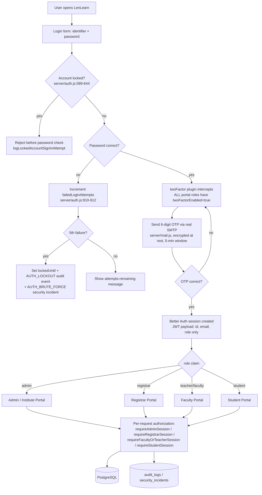

**Correction vs. the example diagram in the prompt:** Faculty and Student are parallel sibling portals, not nested under each other — every role reaches the same login/OTP gate and branches independently on the `role` claim. There is no `School Admin` role distinct from `Admin`; Admin **is** the system administrator (`server/lib/enrollEmailOtpMfa.js:11`).

---

## 2. Input → Process → Output Model

The IPO shape used throughout this document, re-derived from actual code rather than assumed:

```text
INPUT                          PROCESS                                   OUTPUT
Admin submits Subject form  →  1. requireAdminSession                 →  Subject row created
(code, name, grade, sem.,      2. Validate required fields                (curriculum_guide_id optional)
 faculty, curriculum guide      3. Resolve faculty_id                     Schedule row(s) created if
 id, schedule fields)           4. Insert subjects row                     schedule fields supplied
                                5. IF schedule fields present:            SUBJECT_CREATED audit event
                                   assertNoScheduleConflicts               written
                                   (faculty + grade/semester only —       IF curriculum guide linked:
                                   NOT room, NOT section)                  guide's lesson content
                                6. Insert subject_schedules rows           synced into subject's topic
                                7. auditInstituteRecord(                   tree (server/api/state/
                                   'SUBJECT_CREATED')                      subjectsRouter.js:144-145)
                                8. IF curriculum_guide_id set:
                                   sync guide lesson into subject
```

Evidence: `server/api/state/subjectsRouter.js:99-145`. This example is used because Subject creation is the pivot point for the entire academic chain — it is the only place School Year context is implicitly absent, Curriculum is optionally attached, Faculty is attached by real FK, and Schedule conflict-checking runs.

---

## 3. Authentication IPO

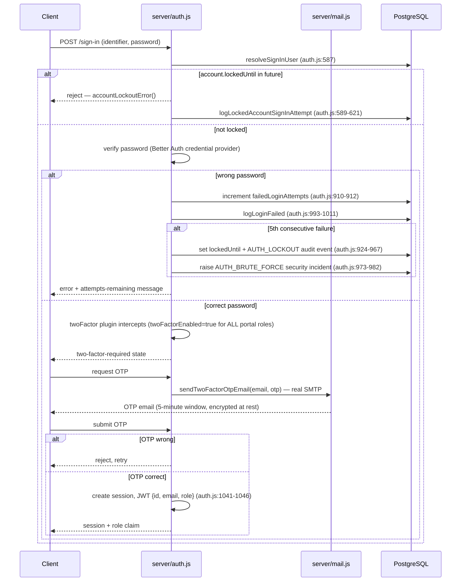

**Authentication vs. Authorization — kept explicitly separate in this codebase:**
- **Authentication** = "is this a real, unlocked account, and did they prove it with password + OTP?" — entirely inside `server/auth.js` / Better Auth, produces a session/JWT with only `{id, email, role}`.
- **Authorization** = "is this authenticated identity allowed to touch this specific resource?" — happens per-route, downstream, via `requireAdminSession` / `requireRegistrarSession` / `requireFacultyOrTeacherSession` / `requireStudentSession` and (for classwork/grades) additional ownership/scope checks like `facultyCanAccessStudent`. **These are two separate code layers**, and the quiz vulnerability in §12 is specifically an authorization-layer failure downstream of a perfectly correct authentication layer.

---

## 4. Admin IPO

Each function traced to its actual validation/process/audit sequence — nothing here is assumed from the UI.

### School Year
```text
INPUT → schoolYear string ("2025-2026")
VALIDATION → requireAdminSession · isValidSchoolYear format check         [server/api/schoolYearV1.js:33,37]
PROCESS → single-row upsert on institute_settings                        [:46]
DATABASE → institute_settings.school_year (one global row, no FK from anything)
OUTPUT → new year value returned
AUDIT → SCHOOL_YEAR_UPDATED                                              [:48]
```

### Curriculum
```text
INPUT → title, subject, grade_level, description, PDF file
VALIDATION → requireAdminSession · validateCurriculumGuideFileAsync ·
             required-field check                                        [server/api/adminCurriculumGuides.js:66,70,83-98]
PROCESS → saveCurriculumGuideFile → insertAdminCurriculumGuide           [:100,104]
DATABASE → curriculum_guides row
OUTPUT → guide appears in Admin curriculum list
AUDIT → CURRICULUM_CREATED                                               [:119]
SIDE EFFECT → if published, syncCurriculumGuideLessonForAllSubjects
              pushes the guide's lesson content into every linked
              subject's topic tree                                       [:128]
```

### Subject (Schedule is embedded here, not a separate endpoint)
```text
INPUT → code, name, grade_level, semester, faculty_id, curriculum_guide_id
        (optional), schedule fields (optional)
VALIDATION → requireAdminSession · required-field check (curriculum_guide_id
             NOT required)                                               [server/api/state/subjectsRouter.js:99,105-113]
PROCESS → insert subjects row → IF schedule fields present:
          assertNoScheduleConflicts (faculty + grade/semester overlap
          ONLY — no room, no section) → insert subject_schedules rows   [:126-135]
DATABASE → subjects, subject_schedules
OUTPUT → subject visible to faculty (own) and students (grade-level match)
AUDIT → SUBJECT_CREATED                                                  [:138]
SIDE EFFECT → if curriculum_guide_id set, sync guide's lesson content
              into this subject                                         [:144-145]
```

### Announcement
```text
INPUT → title, body, type, audience
VALIDATION → requireAdminSession · type check against ANNOUNCEMENT_TYPES [server/api/state/announcementsRouter.js:39]
PROCESS → insert row
DATABASE → announcements
OUTPUT → visible to faculty/student read views
AUDIT → ANNOUNCEMENT_CREATED                                             [:85]
```

### Registrar (account creation)
```text
INPUT → name, email, username, password, optional profile image
VALIDATION → requireAdminSession · name/email presence · username format ·
             password strength · email/username uniqueness              [server/api/registrarsV1.js:81,88,95-116]
PROCESS → createInstituteAuthUserDirect(role:'registrar')               [:118-124]
DATABASE → Better Auth "user" table, role='registrar'
OUTPUT → registrar can sign in, gets auto-enrolled in OTP MFA
AUDIT → (registrar creation logged; MFA enrollment logged separately)
```

### Backup
```text
INPUT → manual trigger or scheduled job
VALIDATION → requireAdminSession on every backup route                  [server/routes/backup.js]
PROCESS → POST /create (:283) · POST /restore-upload (:383) ·
          POST /:id/restore (:730) · Drive/Spaces upload variants
          (:555,:626) · scheduler (:241)
DATABASE → full table coverage enforced by test
           (tests/backup-full-coverage.test.js)
OUTPUT → .lnbak archive, local/Drive/Spaces copies
AUDIT → backup/restore events + DATA_RECOVERY_EVENT security incident
        on restore commit
```

Only the functions above were verified in code; no other "Administrative settings" surface was found to trace.

---

## 5. Registrar IPO

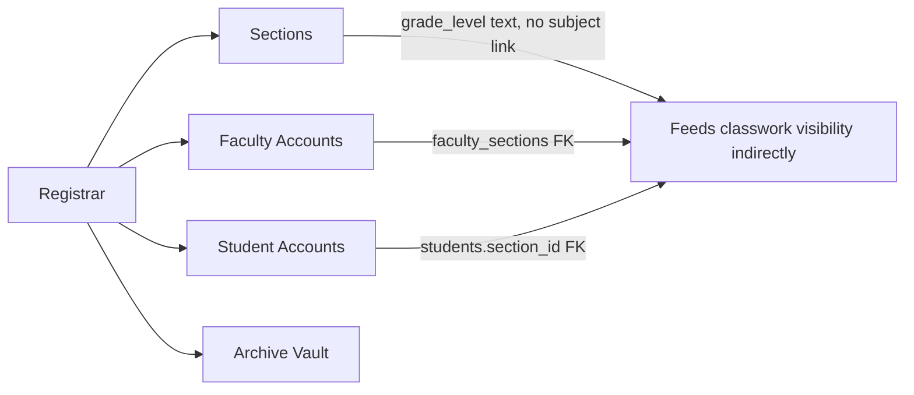

**Corrected create-student chain** (the prompt's example implied a straight pipeline into Subjects/Classwork — the real chain has a weaker link than that):

```text
Registrar creates Student
        ↓  (real FK: students.section_id)
Assign Section
        ↓  (real: Better Auth user provisioning, role='student')
Student Account + auto-enrolled OTP MFA
        ↓  (real: authentication flow, §3)
Authentication
        ↓  (real: role='student' routes to Student Portal)
Student Portal
        ↓  (⚠ TEXT-FIELD MATCH ONLY — not a real join)
Subjects filtered by matching subjects.grade_level to the student's
section's grade_level string — NOT filtered by section_id at all
        ↓
Classwork (assignments/activities/quizzes) — same grade-level-only
filter, so a student sees every section's classwork within their grade
```

This is the first concrete appearance of the Subject↔Section gap that §6 and §8 examine in depth — Registrar-managed data (Section, Student) is solid and FK-backed; it's the *junction* between Section and Subject that's missing.

---

## 6. Academic Workflow Visualization — Current, Not Idealized

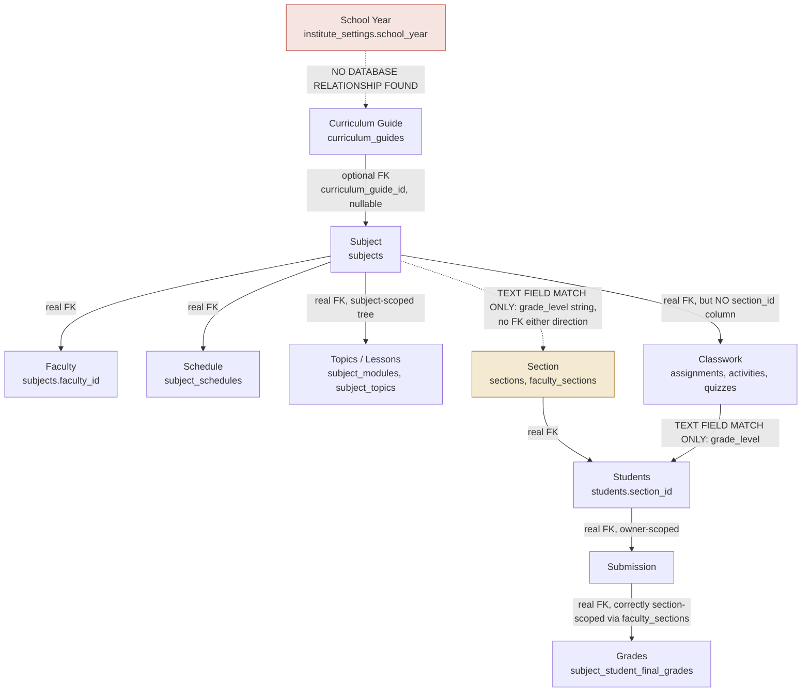

**Reading this diagram:**

```text
Subject ─────X─────> Section
```
**NO DATABASE RELATIONSHIP FOUND.** `subjects` has no `section_id` column, and no `subject_sections` junction table exists anywhere in `Database/migrations/`. The only thing tying them together is that both happen to store a `grade_level` string.

```text
Subject
   │
   └── Grade Level (text match, not FK)
           │
           ├── Section A
           └── Section B

CURRENT BEHAVIOR:
Every list/read query for assignments, activities, and quizzes filters
only on grade_level (server/lib/studentPortalDb.js — zero occurrences
of section_id in this file). Classwork is therefore visible to every
section within the same grade level, not just the intended section.
Individual submission and grade records ARE correctly scoped (owner_id
/ faculty_sections), so this is a content-visibility leak, not a
grade-visibility leak.
```

The one genuinely new wrinkle from this pass: Curriculum → Topic/Lesson is **not** fully disconnected as the first audit implied — `syncCurriculumGuideLessonForAllSubjects` (called from `adminCurriculumGuides.js:128` on publish, and again per-subject at `subjectsRouter.js:144-145` when a guide is linked) pushes the guide's lesson content into the subject's topic tree automatically. This is a real, narrow sync mechanism, not full curriculum-content editability — see §7 and §18 for how this revises the earlier finding.

---

## 7. Curriculum Visualization

### CURRENT SYSTEM

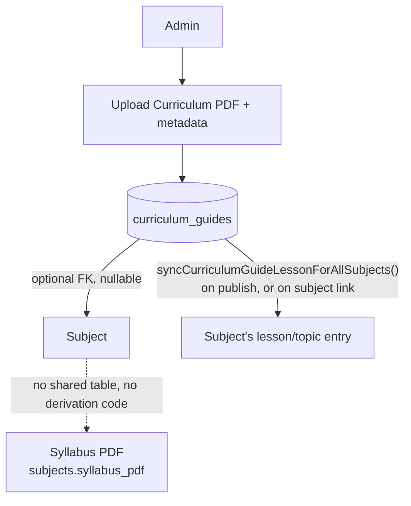

| Relationship | Verdict | Evidence |
|---|---|---|
| Curriculum → Subject | **△ OPTIONAL / PARTIAL** | Real FK `subjects.curriculum_guide_id`, but nullable — a subject can exist with no linked guide (`Database/migrations/059_panel_defense_schema.sql:4`) |
| Curriculum → Syllabus | **✗ NO RELATIONSHIP** | `syllabus_pdf` is an independent text column on `subjects`; no shared table, no code path derives syllabus content from a curriculum guide |
| Curriculum → Topic/Lesson | **△ OPTIONAL / PARTIAL — revised this pass** | A real sync function pushes the guide's lesson content into the subject's topic tree on publish/link (`adminCurriculumGuides.js:128`, `subjectsRouter.js:144-145`). This is narrower than "curriculum drives the full lesson structure" — it appears to push a single lesson entry, not structured curriculum content — but it is a genuine, previously-unflagged connection |
| Curriculum → Grades | **✗ NO RELATIONSHIP** | No code path found linking curriculum guides to grading criteria or grade computation |

### POSSIBLE PANEL-EXPECTED WORKFLOW
*(Not a confirmed Glendale requirement — inferred from the panel transcript's line of questioning. Requires client confirmation before treating as a spec.)*

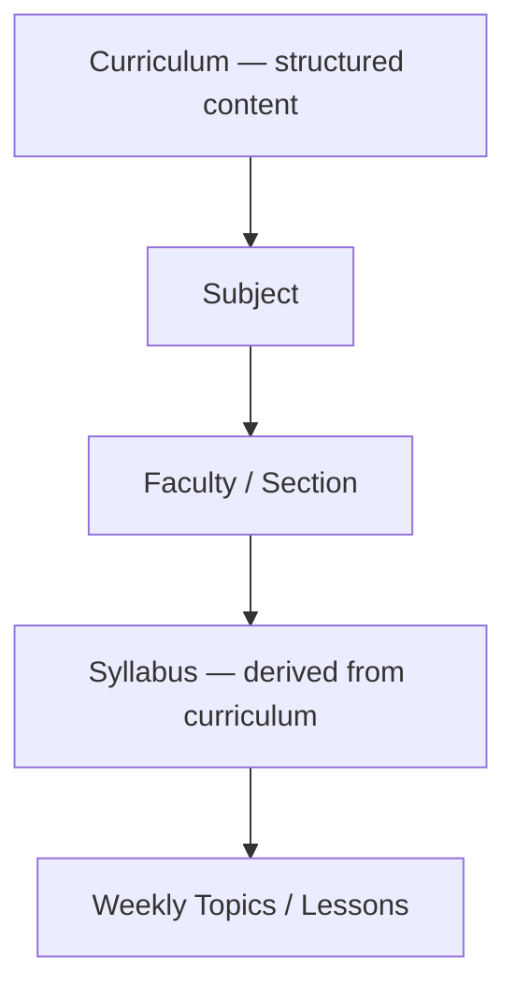

The panel's own words ("the syllabus... the granular... divide and conquer the goal that came from the curriculum, high-level curriculum") describe syllabus as a *computed breakdown* of curriculum content — the current system implements syllabus as an independent upload instead. Whether Glendale actually wants mechanical derivation, or an independent-but-aligned document is acceptable, is listed as a client question in §19.J.

---

## 8. Subject / Section Visualization

### Current database model

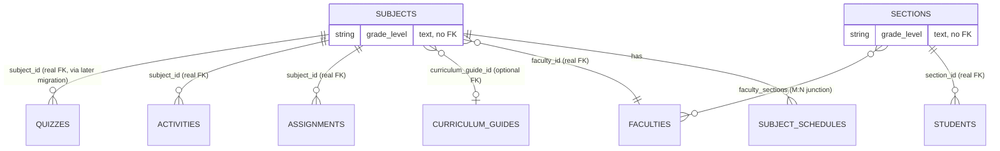

`SUBJECTS` and `SECTIONS` have **no line connecting them** in the real schema — they are drawn separately above deliberately. The only bridge is that both happen to store a `grade_level` string, matched at query time, not at the database level.

```text
Grade 10
   │
   ├── Section A ─┐
   │              ├── both read from subjects WHERE grade_level = '10'
   └── Section B ─┘     with no further filter
          ↑
          │
      Same Grade-Level
       Classwork? → YES, confirmed via server/lib/studentPortalDb.js
```

### OPTION A — Direct FK
```text
Subject
   ↓ (add subjects.section_id)
Section
```
Simplest change. Breaks if Glendale runs one subject shared across multiple sections of the same grade (would force duplicate subject rows per section).

### OPTION B — Junction table
```text
Subject
   ↓
Subject_Sections (subject_id, section_id)
   ↓
Section
```
Allows one subject to legitimately serve multiple sections while still scoping classwork per section via the junction. More flexible, more migration work.

### OPTION C — Subject Definition vs. Class Offering
```text
Subject Definition (code, curriculum guide, grade level)
       ↓
Class Offering (the actual scheduled class)
   ├── Section
   ├── Faculty
   ├── Schedule
   ├── Semester
   └── School Year
```
Closest to how real school information systems model this (a "course" vs. a "course section/offering"). Also the only option that gives School Year a real place in the data model instead of remaining decorative. Highest migration cost.

**Comparison**

| | Migration cost | Solves cross-section leak | Matches "one subject per grade" reality if that's how Glendale runs it | Gives School Year real meaning |
|---|---|---|---|---|
| A | Low | Yes | No — forces duplicate rows | No |
| B | Medium | Yes | Yes | No |
| C | High | Yes | Yes | Yes |

**Technically, Option C is the strongest general-purpose LMS architecture; Option B is the pragmatic middle ground if School Year modeling isn't a near-term priority. Either way: REQUIRES GLENDALE SCHOOL CONFIRMATION** on whether a "subject" is actually offered per-section or shared across a whole grade — that answer determines which option is even correct, independent of engineering preference.

---

## 9. Faculty Workflow IPO

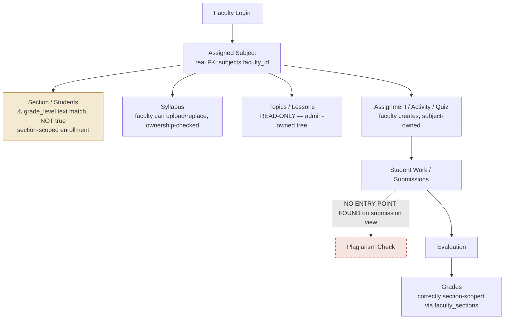

Per-action IPO for the two links worth calling out:

```text
INPUT: faculty views "my students"
PROCESS: query filters by subjects the faculty owns (faculty_id), then
         matches subject.grade_level to students.section.grade_level —
         a text comparison, not a join through subject_sections
OUTPUT: faculty sees every student in that grade level's sections,
        not scoped to a specific section-subject pairing
```

```text
INPUT: faculty opens a student's submission (TeacherAssignmentView.jsx)
PROCESS: no plagiarism-related code exists on this page (zero matches
         for "plagiarism"/"originality" in the file)
OUTPUT: faculty must separately navigate to a standalone Plagiarism
        Checker page and manually paste/re-upload text — MISSING LINK
```

---

## 10. Student Workflow IPO

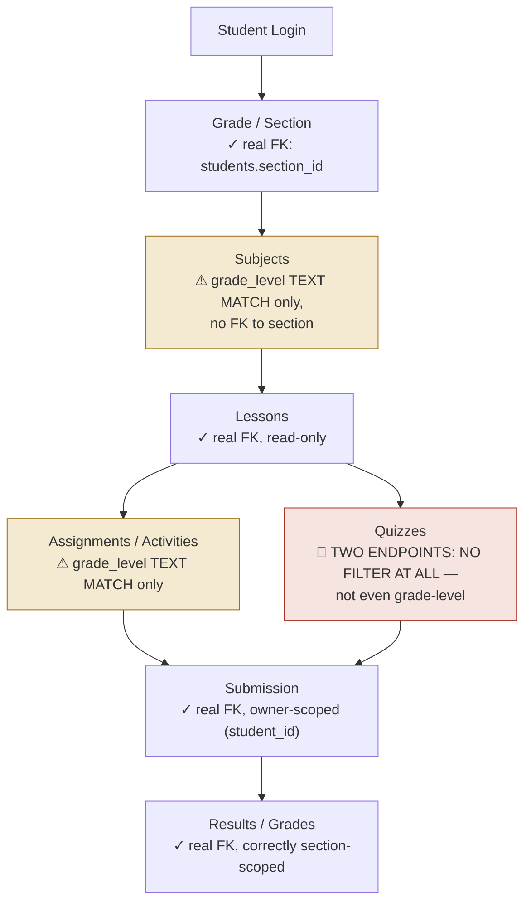

**Filtering audit, verified this pass:**

| Filter type | Applied where? | Verdict |
|---|---|---|
| `student_id` filtering | Submissions, grades, own quiz-attempt records | ✓ Present and correct |
| Grade-level filtering | Assignments, activities, the *scoped* quiz portal (`server/api/studentQuizV1.js`) | ✓ Present (grade only, see below for the gap this leaves) |
| Section filtering | Assignments, activities, quizzes (any router) | ✗ **Missing entirely** — no query in `server/lib/studentPortalDb.js` references `section_id` |
| Subject filtering | All classwork correctly tied to `subject_id` | ✓ Present |
| Any filtering at all | `GET /api/v1/quizzes` and `/api/v1/quizzes/:id` | 🔴 **Missing entirely — not even grade-level.** These two endpoints are reachable in parallel to the properly-scoped student quiz portal and return every non-hidden quiz school-wide, including `is_correct`/`answer_text`. |

---

## 11. Assignment IPO — Full Lifecycle Trace

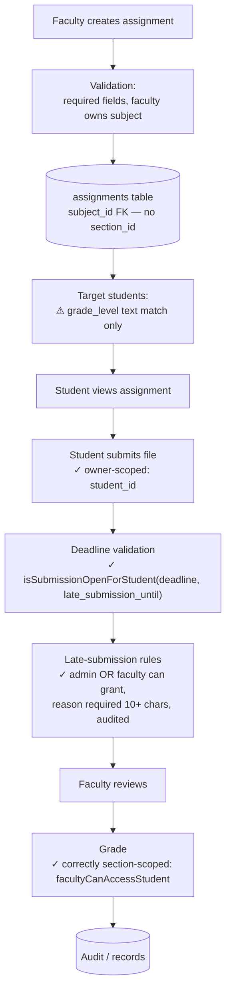

**Where Subject and Section actually participate:**

| Step | Subject's role | Section's role |
|---|---|---|
| Create | Real FK — assignment belongs to exactly one subject | Absent — no field exists to scope by section |
| Target students | Filter is `subjects.grade_level` matched to `students`' section's `grade_level` string | Indirect only, via the shared text value — not a direct participant |
| Submission | Inherited from assignment's subject | Not checked |
| Late-submission grant | Faculty must own the assignment's subject (`facultyOwnsSubject`) | Faculty must have the student in one of their assigned sections (`facultyCanAccessStudent`) — **this is the one place Section is checked by real FK** |
| Grade | Inherited | Real FK check via `faculty_sections` — correctly scoped |

This confirms the pattern seen throughout: **Subject is the load-bearing entity everywhere; Section only becomes a real, enforced boundary at the grading/extension-granting layer, not at the content-visibility layer.**

---

## 12. Quiz IPO + Security Visualization

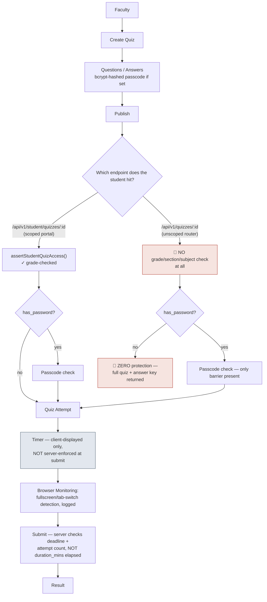

### Security boundary diagram — exact request-handling order (quiz-taking path)

```mermaid
flowchart LR
    S1["1. helmet()<br/>server/index.js:150"] --> S2["2. body parsing<br/>:239-247"]
    S2 --> S3["3. cors()<br/>:248"]
    S3 --> S4["4. sanitizeInput<br/>:299"]
    S4 --> S5["5. rate limiter<br/>:313-322"]
    S5 --> S6["6. route reached<br/>:487-494"]
    S6 --> S7["7. AUTHENTICATION:<br/>session resolution<br/>getSessionUser / requireStudentSession"]
    S7 --> S8["8. role check<br/>requireAnySession / studentGate"]
    S8 --> S9{"9. AUTHORIZATION —<br/>diverges by router"}
    S9 -->|scoped router| S10a["assertStudentQuizAccess<br/>studentQuizV1.js"]
    S9 -->|unscoped router| S10b["🔴 nothing —<br/>straight to query"]
    S10a --> S11["10. passcode check<br/>if has_password"]
    S10b --> S11
    S11 --> S12["11. deadline/attempts check<br/>quizSubmissionsDb.js:659-663"]
    S12 --> S13["12. DB query + response"]

    style S10b fill:#f6e4e0,stroke:#ad3226
```

**🔴 CRITICAL SECURITY GAP — confirmed on two independent passes:** `GET /api/v1/quizzes` and `GET /api/v1/quizzes/:id` (`server/lib/quizzesDb.js:270-294,376-390`) perform authentication and role-checking correctly but skip the authorization/scoping step entirely, and unconditionally include `is_correct`/`answer_text` in the response (`mapChoiceRow`/`mapAnswerRow`, `:187-202`). Any authenticated student can enumerate quiz IDs and read any quiz's answer key, school-wide, before attempting it. If the quiz additionally has no passcode set, there is no secondary barrier of any kind. **Not fixed in this pass — flagged only, per instructions.**

**🔵 LOW — timer not server-enforced:** `duration_mins` only drives a client-side countdown display; `submitQuizSubmission` only checks the assignment-level deadline, so a student who disables/outlasts the client timer can still submit within the deadline window.

---

## 13. Plagiarism Checker IPO

### CURRENT

```text
INPUT
Faculty pastes text OR manually uploads a file
(TeacherOriginalityCheckerPage.jsx — a standalone page,
 NOT reached from any submission view)
       ↓
Plagiarism Process
Local NLP: lexical similarity (natural / TF-IDF) +
optional semantic pass (@xenova/transformers embeddings)
       ↓
Report
Stored, faculty-scoped, re-viewable later —
but with NO submission_id / student_id / assignment_id column
(plagiarism_reports table, Database/migrations/029_plagiarism_reports.sql
 and all later additions — confirmed no linkage column exists)
```

### PANEL-REQUESTED WORKFLOW (for comparison)

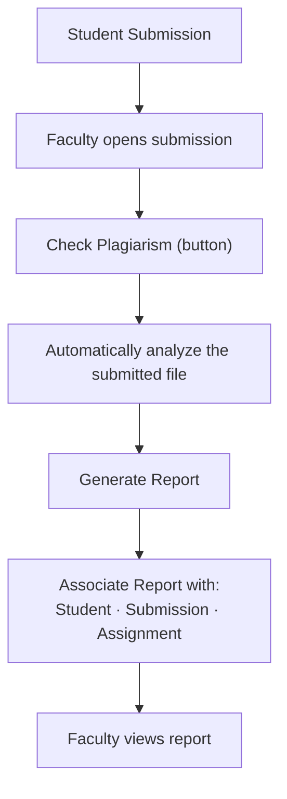

### WHERE THE CURRENT WORKFLOW BREAKS

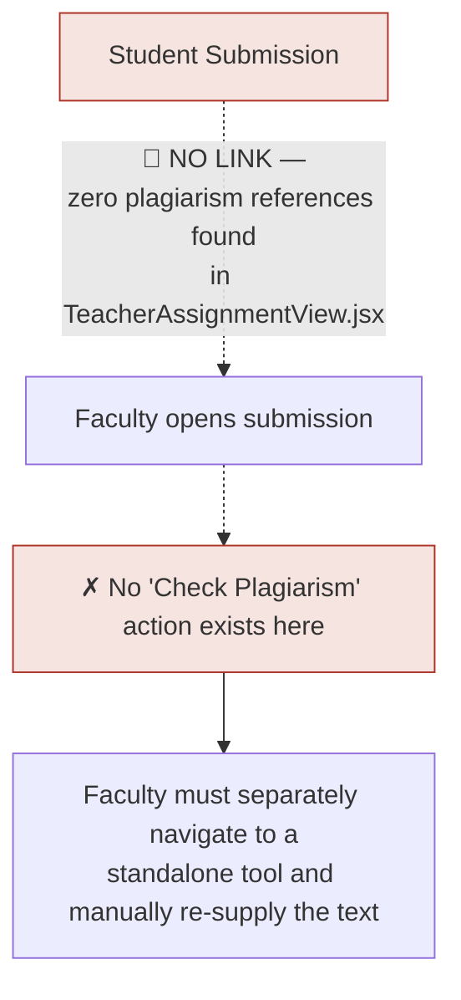

The break happens at the very first step — there is no connective tissue between "a submission exists" and "a plagiarism check can be run on it." Everything past that point (analysis engine, report storage, faculty re-access) works correctly in isolation; it's simply never triggered from the place the panel expects it to be triggered from.

---

## 14. Schedule IPO

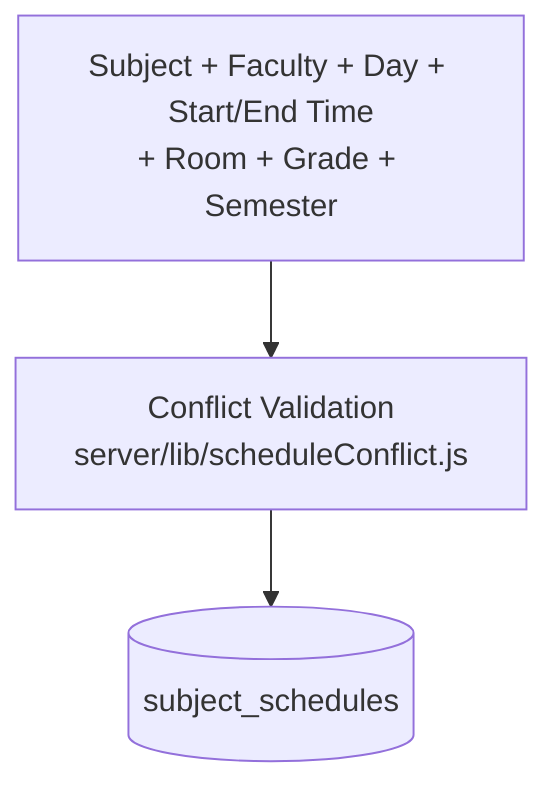

| Conflict type | Checked? | Evidence |
|---|---|---|
| Faculty conflict (same faculty, overlapping day+time) | ✓ | `detectFacultyConflicts`, `loadFacultyScheduleSlots` |
| Grade conflict (same grade+semester, overlapping day+time) | ✓ | `detectGradeConflicts`, `loadGradeScheduleSlots` |
| Section conflict | PARTIAL — subsumed into grade conflict | No true section concept on `subjects`, so grade-level overlap is the closest proxy; a genuine per-section check isn't possible without the §8 architecture decision |
| Room conflict | ✗ | `room` is stored on `subject_schedules` and returned for display, but never compared anywhere in `scheduleConflict.js` |
| Semester | ✓ | Included as part of the grade-conflict key |
| School year | ✗ | No relationship exists between `institute_settings.school_year` and any schedule/subject row — see §6 |

---

## 15. Archive + Audit IPO

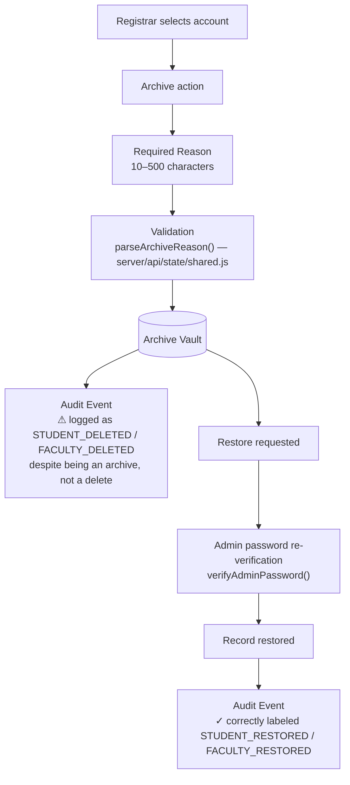

**Accountability fields — verified present for every event type sampled:**

```text
WHO      → performed_by / performed_by_name          ✓ present
WHAT     → event_type / action                       ✓ present (naming caveat above)
WHEN     → created_at                                ✓ present
TARGET   → target_id / target_label                  ✓ present
REASON   → archive_reason (stored in the record       ✓ present, validated,
            itself, not just the audit log)              permanent
     ↓
AUDIT LOG — all five fields structurally captured
```

No reachable delete path for student/faculty accounts was found this pass (the only raw `DELETE FROM students/faculties` SQL lives in a disabled auto-purge job, two guard layers deep, unreachable in normal operation).

---

## 16. Security Visualization

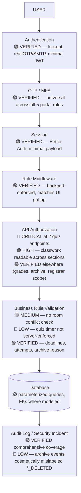

Severity key: 🔴 CRITICAL · 🟠 HIGH · 🟡 MEDIUM · 🔵 LOW · 🟢 VERIFIED/WORKING. No item above is escalated beyond what the second-pass code trace directly supports.

---

## 17. Current vs. Expected System

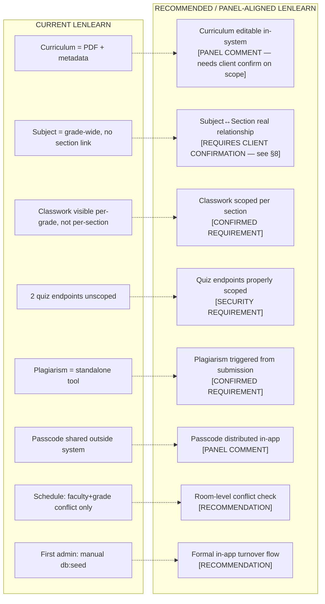

---

## 18. Re-Validation of the Previous Audit

Every major finding was re-traced independently this pass, against current code, with fresh file:line citations rather than recalled ones.

| Finding | Verdict this pass | Notes |
|---|---|---|
| Quiz answer-key exposure | **CONFIRMED** | Identical mechanism, re-confirmed with sharper detail: quizzes with no passcode have zero secondary barrier |
| Quiz authorization (scoped vs. unscoped router split) | **CONFIRMED** | Exact middleware/handler order re-traced (§12) |
| Cross-section classwork visibility | **CONFIRMED** | `studentPortalDb.js` re-read; zero `section_id` occurrences confirmed again |
| Admin/Registrar separation | **CONFIRMED** | Role strings, `requireAdminSession`/`requireRegistrarSession`, and nav-scope constants all re-verified unchanged |
| Curriculum PDF limitation | **CONFIRMED — with new detail** | Metadata-only editing confirmed, but a real (if narrow) curriculum→lesson sync mechanism was newly found — see below |
| Syllabus relationship | **CONFIRMED** | Independent PDF field, dual-owner (admin + faculty) upload confirmed again |
| Schedule conflict validation | **CONFIRMED** | Faculty + grade/semester checked; room never compared, re-confirmed by re-reading `scheduleConflict.js` in full |
| Room conflict | **CONFIRMED** | `room` column exists on `subject_schedules`, used only for display, never in conflict detection |
| Late submission | **CONFIRMED** | Admin + faculty both gated correctly; quiz path still explicitly rejected (`NOT_APPLICABLE`) despite schema support |
| Plagiarism checker | **CONFIRMED** | No linkage columns, no submission-view entry point, both re-confirmed by direct grep/read |
| Archive | **CONFIRMED** | Reason requirement, validation bounds, restore password re-verification all re-confirmed |
| Audit logs | **CONFIRMED** | WHO/WHAT/WHEN/TARGET all structurally present; `*_DELETED` naming issue re-confirmed unchanged |
| Offline support | **PARTIALLY CONFIRMED — new detail** | Read-only caching breadth reconfirmed; newly confirmed that admin/faculty/registrar API routes are entirely excluded from the cache (network-first-or-503) — the offline layer is more strictly student-scoped than previously stated |
| Initial Admin turnover | **CONFIRMED** | Manual `npm run db:seed` bootstrap reconfirmed; `INSTITUTE_ADMIN_EMAIL` reconfirmed as a hardcoded constant, not an env var |

**NEW INFORMATION FOUND (contradicts a first-audit framing, flagged per instructions):** The first audit described `subject_topics`/`subject_modules` as "a separate tree with no relationship to `curriculum_guides`." This pass found that is only mostly true — `adminCurriculumGuides.js:128` and `subjectsRouter.js:144-145` both call a sync function that pushes a curriculum guide's lesson content into the subject's topic tree automatically when the guide is published or linked. This does **not** mean curriculum content is structurally editable or that the panel's "curriculum drives lessons" expectation is met — it appears to sync a single lesson entry, not a full structured breakdown — but it is a real, previously-unflagged connection worth citing accurately rather than saying "no relationship" outright. Recommend a follow-up read of `syncCurriculumGuideLessonForAllSubjects` itself if precise behavior matters for the defense.

---

## 19. Final Conclusion

### A. How LenLearn Works Today (defense-ready plain explanation)

LenLearn authenticates every user — Admin, Registrar, Faculty, and Student alike — through the same password-plus-email-OTP flow, with account lockout after five failed attempts. Once signed in, a minimal JWT carries only an identity and a role; every subsequent action is re-checked against that role at the API layer, not just hidden in the UI. Four roles exist for real: Admin runs curriculum, subjects, announcements, audit, and backup; Registrar runs sections, faculty and student accounts, and the archive vault; Faculty manage their own assigned subjects' classwork and grade their own sections; Students see content matched to their grade level and submit work tied to their own account. The academic chain runs Curriculum Guide → Subject → Schedule → Topics/Lessons → Classwork → Submission → Grades, with Faculty and Section joined onto Subject correctly by real foreign keys — except Section itself, which only connects to Subject through a shared grade-level text string, not a database relationship. That one gap is why classwork currently reaches a wider audience (the whole grade level) than the "per subject and section" requirement calls for, and it's the same architectural root cause behind the quiz answer-key exposure found in this pass. Everything downstream of a submission — grading, late-submission extensions, archiving, audit logging — is properly scoped and accounted for.

### B. Master IPO Table

| Module | Input | Process | Output | Role | Database | Status |
|---|---|---|---|---|---|---|
| Authentication | Credentials + OTP | Lockout check → password → OTP → session | Role-based portal | All | Better Auth `user` table | 🟢 Verified |
| School Year | Year string | Format validate → upsert | Display value | Admin | `institute_settings` | 🟢 Verified (but decorative) |
| Curriculum | PDF + metadata | Validate → save file → insert → sync lesson | Guide listed, subject lesson synced | Admin | `curriculum_guides` | 🟡 Partial (file-based) |
| Subject | Code/name/grade/sem./faculty/guide/schedule | Validate → insert → conflict check → schedule insert | Subject visible to faculty/students | Admin | `subjects`, `subject_schedules` | 🟢 Verified |
| Section | Grade + name | Create | Section available for enrollment | Registrar | `sections` | 🟢 Verified |
| Faculty account | Profile + advisory section(s) | Validate → create → MFA enroll | Faculty can sign in | Registrar | `faculties`, `faculty_sections` | 🟢 Verified |
| Student account | Profile + section | Validate → create → MFA enroll | Student can sign in | Registrar | `students` | 🟢 Verified |
| Topics/Lessons | Title, content, order | Admin-write, faculty read-only enforced | Subject topic tree | Admin | `subject_modules`, `subject_topics` | 🟢 Verified |
| Assignment/Activity | Title, instructions, deadline | Validate ownership → insert | Visible to grade-level students | Faculty | `assignments`, `activities` | 🟠 High (grade-only scope) |
| Quiz | Questions, answers, passcode | Validate → hash passcode → insert | Visible via scoped OR unscoped router | Faculty | `quizzes` | 🔴 Critical (unscoped endpoints) |
| Submission | File / answers | Validate deadline/attempts → store | Faculty can grade | Student | `submissions`, `quiz_submissions` | 🟢 Verified |
| Late submission | Reason + entity | Validate ownership → set override | Student can still submit | Admin/Faculty | override columns | 🟡 Partial (quiz path blocked) |
| Plagiarism check | Pasted/uploaded text | NLP similarity + optional embeddings | Report stored | Faculty | `plagiarism_reports` | 🔴 Not linked to submissions |
| Grade | Score entry | Validate section ownership → compute | Student sees result | Faculty | `subject_student_final_grades` | 🟢 Verified |
| Archive | Reason | Validate length → set archived_at | Vault entry, audit event | Registrar | `archived_at`, `archive_reason` | 🟢 Verified |
| Audit/Security | System events | Log actor/action/target/time | Reviewable ledger | System | `audit_logs`, `security_incidents` | 🟢 Verified |
| Backup | Trigger | Snapshot all tables + uploads | `.lnbak` archive | Admin | all tables | 🟢 Verified |
| Offline | Cached reads | Service worker cache-first for read routes | Cached materials/quizzes/grades | Student-facing only | IndexedDB, Cache API | 🟢 Verified (scope: student reads + quiz sync only) |

### C. Current System Diagram

*(See §1 for the full diagram — reproduced conceptually here as the "master" reference.)*

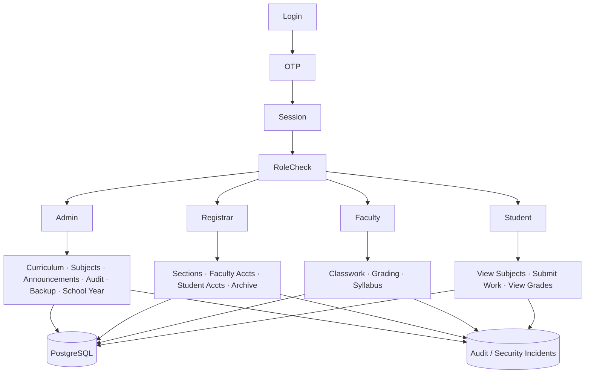

### D. Role Workflow Diagram

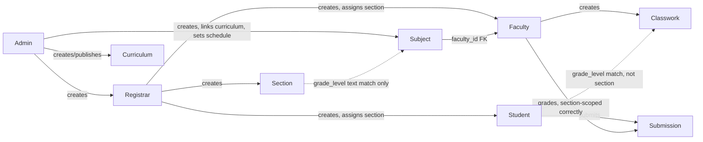

### E. Academic Workflow Diagram

*(Full version with relationship annotations is §6 — this is the compact form for quick reference.)*

```mermaid
flowchart LR
    SchoolYear -.->|no relationship| Curriculum
    Curriculum -->|optional FK| Subject
    Subject -->|real FK| Schedule
    Subject -.->|text match only| Section
    Section --> Students
    Subject --> Topics
    Subject -->|no section_id| Classwork
    Classwork -.->|text match only| Students
    Students --> Submission
    Submission -->|correctly scoped| Grades
```

### F. Security Boundary Diagram

```mermaid
flowchart TD
    Authentication["Authentication 🟢"] --> Authorization["Authorization<br/>🟢 most routes / 🔴 2 quiz endpoints"]
    Authorization --> DataAccess["Data Access<br/>🟠 grade-only classwork scoping"]
    DataAccess --> Audit["Audit 🟢"]
```

### G. Confirmed Problems (code-verified only)

1. Two quiz endpoints return unscoped quiz content and answer keys to any student. 🔴
2. Assignments/activities/quizzes are filtered by grade level only, not by section — cross-section content visibility. 🟠
3. `subjects` has no `section_id`; no subject–section junction table exists. 🟠
4. Schedule conflict validation does not check room double-booking. 🟡
5. Quiz late-submission is explicitly blocked server-side despite schema support. 🟡
6. Plagiarism checker has no linkage to submissions and no entry point from the submission view. 🟠
7. Quiz passcodes are cryptographically real but still communicated to students outside the system. 🟡
8. Quiz timer is not server-enforced at submission (deadline is, duration isn't). 🔵
9. First admin account requires a manual database seed step, not an in-app flow. 🟡
10. Archive actions are logged under misleading `*_DELETED` event names. 🔵
11. Dead auto-purge code containing a raw account-delete path remains in the repository (disabled, not removed). 🔵

### H. Panel Comments Already Satisfied (do not rebuild)

- Admin/Registrar role conflation — a real, separate, tested Registrar role already exists with the correct scope.
- Weekday "select all" scheduling UX.
- Schedule conflict checking for faculty double-booking and grade-level overlap.
- Syllabus creation ownership — both Admin and Faculty can manage it, resolving the transcript's confusion.
- Archiving with a required, validated, permanently-stored reason.
- Audit trail depth (who/what/when/target).
- Late submission granting by Faculty (for assignments/activities).
- Faculty roster PII exclusion + `STUDENT_PROFILE_VIEWED` logging.

### I. Panel Comments Still Unsatisfied (verified gaps only)

- Curriculum content is still an uploaded PDF, not in-system-editable content.
- Syllabus is not derived from curriculum data.
- No conflicting-schedule validation for rooms.
- Cross-section classwork visibility (the panel didn't raise this directly, but it's a direct consequence of the "per subject and section" requirement they did raise).
- Plagiarism checker isn't one-click from a submission.
- Quiz passcodes still distributed outside the system.

### J. Client Decisions Needed

1. Is curriculum-as-PDF an acceptable permanent scope limitation for Glendale?
2. Should syllabus be mechanically derived from curriculum data, or is an independent aligned document acceptable?
3. Does Glendale run one subject per grade level (shared across sections), or one subject offering per section — this decides which of Options A/B/C in §8 is even correct?
4. Should room-level scheduling conflicts block subject scheduling?
5. Should quiz passcodes be distributed inside LenLearn?
6. Should late-submission extensions apply to quizzes too?
7. Is a manual first-admin database seed acceptable for the real Glendale handoff, or is a formal in-app turnover flow expected?

### K. Recommended Future Architecture

```mermaid
flowchart TD
    subgraph MUST["MUST FIX"]
        M1[Scope quiz endpoints to grade/section]
        M2[Strip answer keys from unattempted quiz responses]
    end
    subgraph REC["RECOMMENDED"]
        R1[Add room-conflict checking]
        R2[Wire plagiarism checker to submission view]
        R3[In-app passcode distribution]
        R4[Enable quiz late-submission]
        R5[Rename archive audit events]
    end
    subgraph CLIENT["CLIENT DECISION REQUIRED"]
        D1["Subject↔Section architecture<br/>(Option A / B / C, §8)"]
        D2[Curriculum editability scope]
        D3[Syllabus derivation model]
        D4[First-admin turnover flow]
    end
    MUST --> REC --> CLIENT
```

### L. Recommended Implementation Order (safest sequence — nothing implemented yet)

1. **Fix the two unscoped quiz endpoints** (add grade/section filtering, strip answer-key fields) — isolated, low blast-radius, no schema change, resolves the only 🔴 CRITICAL item.
2. **Get Glendale's answer on Client Decision 3** (Subject↔Section model) before touching schema — this single decision determines whether Options A, B, or C is correct, and doing it twice would be wasted work.
3. **Implement the chosen Subject↔Section architecture** as an additive migration (new column or junction table), then update classwork read queries to use it — this is the highest-value fix and should land before any panel demo.
4. **Add room-conflict checking** to `scheduleConflict.js` — small, additive, no schema change needed (column already exists).
5. **Wire the plagiarism checker to the submission view** and add the linkage columns — additive migration, isolated UI change.
6. **Enable quiz late-submission** — remove the existing rejection branch; schema already supports it.
7. **In-app passcode distribution** and **archive event renaming** — cosmetic/UX, safe to do anytime, no urgency.
8. **First-admin turnover flow** and **dead code removal** — lowest urgency, purely operational/cleanliness, do last.

---

**VALIDATION COMPLETE — READY FOR REVIEW BEFORE IMPLEMENTATION**
